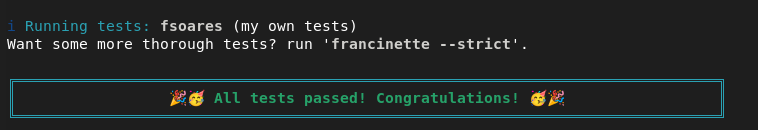

# Implementación de **printf**

Depende de mi libreria;

https://github.com/ksergiocom/c_42_libft

Implementando un printf solo con las funciones *write*,*malloc*,*free* y *<stdarg.h>*

Se crea una librería usando **ar** para reutilizar todo mi **libft** y agregando esta nueva funciona, además de algunas auxiliares.

*¡No se gestiona el buffer como en el printf() original!*

Para crear la librería usar **make** y para hacer pruebas podemos usar **make test**

El resultado es una libreria estática **.a** que podemos lincar para usar nuestra nueva funcion y las anteriores.

## Explicación

La mayor parte del trabajo consiste en gestionar los corner cases: **printf** devuelve el número de bytes escritos y debemos tener en cuenta estos casos.

- **%c** Escribir un solo caracter.
- **%s** Cadena de caracteres por defecto de C. *¡El corner case es si recibimos un NULL! Debemos escribir **(null)** por stdout.* 
- **%p** el puntero void* en formato hexadecimal con el formato 0xfffff *¡El corner case es el puntero nulo que se imprimie como **nil**!*
- **%i** Entero con signo.
- **%d** Entero con signo, lo mismo que **%i** 
- **%u** Entero SIN signo *¡El corner case son los negativos u overflows!* 
- **%x** Hexadecimales en minúsculas. *No llevan prefijo*
- **%X** Hexadecimales en mayúsculas. *No llevan prefijo*
- **%%** Simplemente una forma de escapar el *%*

